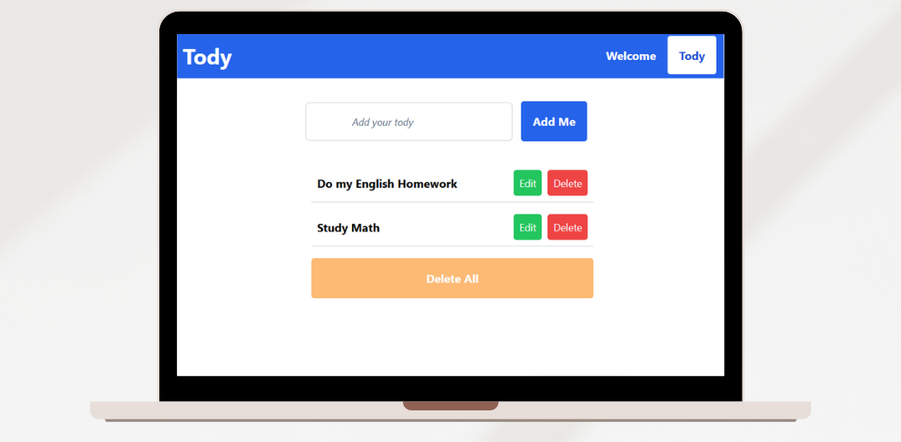

# Tody React ToDo List with Tailwind CSS

A modern ToDo list application built with React js. This app allows users to add, edit, and delete tasks. It also includes a feature to delete all tasks at once. The app uses React Hooks (`useState`, `useEffect`) for managing state and side effects, Axios for API requests, React Router (`useNavigate`, `useLocation`) for navigation, and Tailwind CSS for styling.

 <!-- Add path to your image here -->

## Features

- **Add Tasks:** Add new tasks to your ToDo list.
- **Edit Tasks:** Edit existing tasks and update their details.
- **Delete Tasks:** Remove tasks from the list individually.
- **Delete All Tasks:** Remove all tasks from the list with a single click.

## Technologies Used

- **React**: JavaScript library for building user interfaces.
- **React Router**: For navigation between different views and pages.
- **Tailwind CSS**: For modern, utility-first CSS styling.
- **React Hooks**: `useState`, `useEffect`, `useNavigate`, `useLocation`.
- **Axios**: For making HTTP requests to the backend API.


## API Integration

This project communicates with a backend API to perform CRUD (Create, Read, Update, Delete) operations for tasks. The frontend app is built to be **backend-agnostic**, meaning you can use **any backend** (Node.js, Python, Ruby on Rails, Laravel, etc.) to handle the API requests. 

If you'd like to use **Laravel** as your backend, follow the instructions below to set it up. 

### Backend Requirements

To run this project successfully, you must have a backend API running. The default API URLs in the app are set to work with a Laravel backend, but you can adjust the URLs to match your preferred backend.

#### If you want to use **Laravel** as the backend:

- Clone the [Laravel backend repository](https://github.com/HebaAbdElhamed/Laravel-Todo-API.git).
- Follow the instructions in the Laravel repo to set up your backend.
- Make sure to start the Laravel server using the following command:
   ```bash
   php artisan serve
- Make sure your backend API is running (default is `http://127.0.0.1:8000/api/tasks`).

Once the backend is set up, make sure to update the API URLs in `src/Today.js` with your backend URL if it's different.

### Axios and API Requests

The app uses **Axios** to send HTTP requests from the frontend to the backend. The app supports the following HTTP methods:

- **GET**: Fetches all tasks from the API.
- **POST**: Adds a new task.
- **PUT**: Updates an existing task.
- **DELETE**: Deletes a specific task or all tasks.

Make sure the API URLs in the React app match your backend setup.

## Installation

To get this project up and running on your local machine, follow these steps:

1. **Clone the repository:**

   ```bash
   git clone https://github.com/HebaAbdElhamed/To-Do-List.git

2. **Navigate to the project directory:**

    ```bash
    cd To-Do-List

3. **Install the dependencies:**

    ```bash
    npm install

4. **Start the development server:**

    ```bash
    npm start

5. **Open your browser and go to http://localhost:3000 to see the app running.**
6. **Ensure your backend API is running** (Review the backend setup section above).

## Usage

### Adding a Task
- To add a task, simply type your task in the input field and click the "Add Me" button. The task will be added to the database and displayed on the UI immediately.

### Editing a Task
- To edit a task, click the "Edit" button next to the task you wish to edit. The task's current name will appear in the input field, allowing you to modify the task and save it.

### Deleting a Task
- To delete a task, click the "Delete" button next to the task you want to remove. The task will be deleted from both the UI and the database.

### Deleting All Tasks
- To delete all tasks, click the "Delete All" button at the bottom of the list. All tasks will be cleared from the list and deleted from the database.

## File Structure
   
      /To-Do-List
      │
      ├── /public
      │   ├── index.html
      │   └── ...
      │
      ├── /src
      │   ├── /components
      │   │   ├── Button.js
      │   │   ├── Header.js
      │   │   └── ...
      │   ├── /pages
      │   │   ├── Today.js
      │   │   └── Welcome.js
      │   ├── App.js
      │   ├── index.js
      │   └── ...
      │
      ├── tailwind.config.js
      └── package.json
      └── ...

## Author
Created by [Heba AbdElhamed](https://github.com/HebaAbdElhamed).
